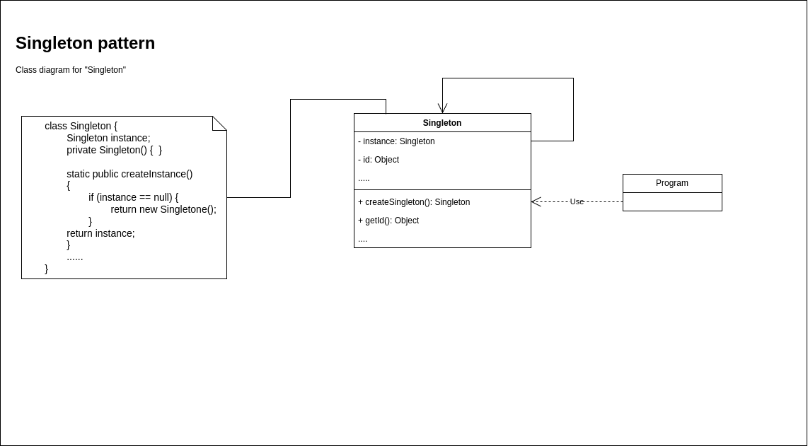

## Архитектура ПО (семинары)
### Урок 2. Объектно-ориентированные паттерны.

* Задание 1. Закончить разработку паттерна Фабричный метод
  * OperatingSystemLogEventReader.java -- добавлено чтение auth.log - файла
* Задание 2. Познакомиться с другими типами паттернов (задание по желанию)
    * Добавлена реализация паттерна Синглтон
    * Добавлена диаграмма паттерна Синглтон

