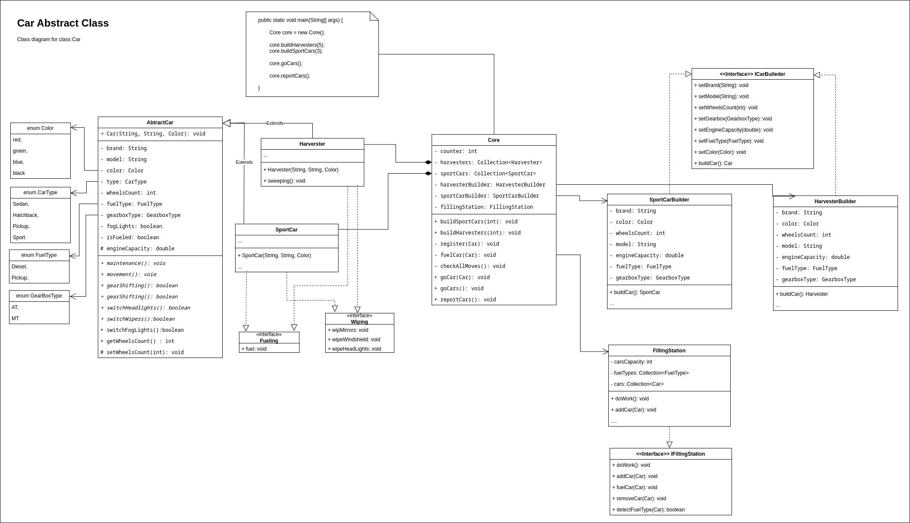

## Архитектура ПО (семинары)
### Урок 3. Принципы SOLID

1. Спроектировать абстрактный класс «Car» y которого должны
   быть свойства: марка, модель, цвет, тип кузова, число колёс, тип
   топлива, тип коробки передач, объём двигателя; методы:
   движение, включение фар, включение дворников.
2. Создать конкретный автомобиль путём наследования класса «Car».
3. Расширить абстрактный класс «Car», добавить метод: подметать улицу. Создать конкретный автомобиль путём наследования класса «Car». Провести проверку принципа SRP.
4. Расширить абстрактный класс «Car», добавить метод:
   включение противотуманных фар, перевозка груза. Провести
   проверку принципа ВСР.
5. Создать конкретный автомобиль путём наследования класса «Cor», определить число колёс = 3. Провести проверку принципа LSP.
6. Создать конкретный автомобиль путём наследования класса «Car», определить метод «движение» - «полёт». Провести проверку принципа LSP.
7. Создать интерфейс «Заправочная станция», создать метод: заправка топливом.
8. Имплементировать метод интерфейса «Заправочная станция» в конкретный класс «Саг».
9. Добавить в интерфейс «Заправочная станция» методы: протирка лобового стекла, протирка фар, протирко зеркал.
10. Имплементировать все методы интерфейса «Заправочная станция» в конкретный класс «Car». Провести проверку
    принципа ISP. Создать дополнительный/е интерфейсы и имплементировать их в конкретный класс «Car». Провести проверку принципа ISP.
11. Создать путём наследования класса «Car» два автомобиля: с бензиновым и дизельным двигателями, имплементировать метод «Заправка топливом» интерфейса «Заправочная станция». Реализовать заправку каждого автомобиля подходящим топливом.
     Провести проверку принципа DIP.

Диаграмма классов
