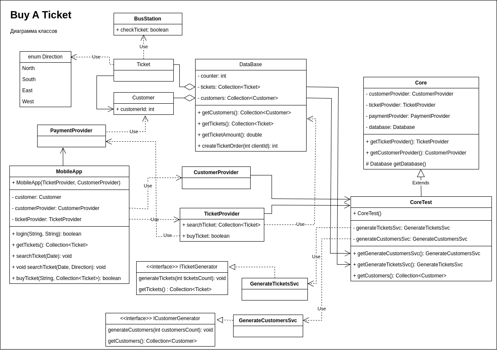

## Архитектура ПО (семинары)
### Урок 4. Компоненты. Принципы связности и сочетаемости компонентов

### Разработать контракты и компоненты системы "Покупка онлайн билета не автобус в час пик"

1. Предусловия.
2. Постусловия.
3. Инвариант.
4. Определить абстрактные и конкретные классы.
5. Определить интерфейсы.
6. Реализовать наследование.
7. Выявить компоненты.
8. Разработать диаграмму компонент используя нотацию UML 2.0. Общая, без деталей.

Диаграмма классов

Общая схема приложения (с семинара)

